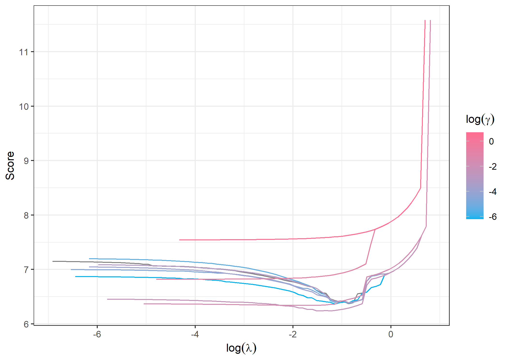

<!-- README.md is generated from README.Rmd. Please edit that file -->

# BITS

<!-- badges: start -->
<!-- badges: end -->

BITS (boosting interaction tree stumps) is a statistical learning method
that fits linear interaction models such as $$
\mathbb{E}[Y | \boldsymbol{X} = \boldsymbol{x}] = \beta_0 + \beta_1 x_1 + \beta_2 x_3 x_{42} + \beta_3 x_9 + \beta_4 x_1 x_5 x_{10}.
$$ The main idea is to use interaction tree stumps, i.e., decision tree
stumps or simple linear regression models that may depend on one single
input feature or interaction term, as base learner in gradient boosting.

To avoid overfitting and detecting unnecessarily complex interactions,
interaction tree stumps $m$ are fitted by minimizing
$\mathrm{MSE}(m) + \gamma ||m||_0$, where $\gamma \geq 0$ is a penalty
hyperparameter and $||m||_0$ counts the number of variables contained in
the term modeled by the interaction tree stump $m$.

## Installation

You can install the latest version of BITS from GitHub like so:

``` r
devtools::install_github("michlau/BITS")
```

## Example

Here is an example of an epidemiological toy data set consisting of some
SNPs and a target quantitative phenotype.

``` r
library(BITS)
```

### Data generation

``` r
set.seed(123)
maf <- 0.25
n <- 3000
p <- 50
X <- matrix(sample(0:2, p * n, replace = TRUE,
                   prob = c((1-maf)^2, 1-(1-maf)^2-maf^2, maf^2)), ncol = p)
truth <- X[,1] + X[,2] * (X[,3] > 0) + 2 * X[,2] * (X[,4] < 2) * (2-X[,5])
y <- truth + rnorm(n, 0, sd(truth))

train.ind <- 1:1000; val.ind <- 1001:2000; test.ind <- 2001:3000
```

### Identify and apply modes of inheritance

``` r
X.moi <- applyMOI(X, MOI(X[train.ind,], y[train.ind]))
```

### Fit BITS models for a grid of gamma and lambda values

``` r
model <- BITS.complete(X[train.ind,], y[train.ind], max.iter = function(p) 1000,
                       gsteps = 10)
#>  Iteration 1/50 (2%) Iteration 2/50 (4%) Iteration 3/50 (6%) Iteration 4/50 (8%) Iteration 5/50 (10%) Iteration 6/50 (12%) Iteration 7/50 (14%) Iteration 8/50 (16%) Iteration 9/50 (18%) Iteration 10/50 (20%) Iteration 11/50 (22%) Iteration 12/50 (24%) Iteration 13/50 (26%) Iteration 14/50 (28%) Iteration 15/50 (30%) Iteration 16/50 (32%) Iteration 17/50 (34%) Iteration 18/50 (36%) Iteration 19/50 (38%) Iteration 20/50 (40%) Iteration 21/50 (42%) Iteration 22/50 (44%) Iteration 23/50 (46%) Iteration 24/50 (48%) Iteration 25/50 (50%) Iteration 26/50 (52%) Iteration 27/50 (54%) Iteration 28/50 (56%) Iteration 29/50 (58%) Iteration 30/50 (60%) Iteration 31/50 (62%) Iteration 32/50 (64%) Iteration 33/50 (66%) Iteration 34/50 (68%) Iteration 35/50 (70%) Iteration 36/50 (72%) Iteration 37/50 (74%) Iteration 38/50 (76%) Iteration 39/50 (78%) Iteration 40/50 (80%) Iteration 41/50 (82%) Iteration 42/50 (84%) Iteration 43/50 (86%) Iteration 44/50 (88%) Iteration 45/50 (90%) Iteration 46/50 (92%) Iteration 47/50 (94%) Iteration 48/50 (96%) Iteration 49/50 (98%) Iteration 50/50 (100%)Boosting done
#>  Iteration 1/50 (2%)Boosting done
#>  Iteration 1/50 (2%) Iteration 2/50 (4%) Iteration 3/50 (6%) Iteration 4/50 (8%) Iteration 5/50 (10%) Iteration 6/50 (12%) Iteration 7/50 (14%) Iteration 8/50 (16%)Boosting done
#>  Iteration 1/50 (2%) Iteration 2/50 (4%) Iteration 3/50 (6%) Iteration 4/50 (8%) Iteration 5/50 (10%) Iteration 6/50 (12%) Iteration 7/50 (14%) Iteration 8/50 (16%) Iteration 9/50 (18%) Iteration 10/50 (20%) Iteration 11/50 (22%) Iteration 12/50 (24%) Iteration 13/50 (26%) Iteration 14/50 (28%) Iteration 15/50 (30%) Iteration 16/50 (32%) Iteration 17/50 (34%) Iteration 18/50 (36%) Iteration 19/50 (38%) Iteration 20/50 (40%) Iteration 21/50 (42%) Iteration 22/50 (44%) Iteration 23/50 (46%) Iteration 24/50 (48%)Boosting done
#>  Iteration 1/50 (2%) Iteration 2/50 (4%) Iteration 3/50 (6%) Iteration 4/50 (8%) Iteration 5/50 (10%) Iteration 6/50 (12%) Iteration 7/50 (14%) Iteration 8/50 (16%) Iteration 9/50 (18%) Iteration 10/50 (20%) Iteration 11/50 (22%) Iteration 12/50 (24%) Iteration 13/50 (26%) Iteration 14/50 (28%) Iteration 15/50 (30%) Iteration 16/50 (32%) Iteration 17/50 (34%) Iteration 18/50 (36%) Iteration 19/50 (38%) Iteration 20/50 (40%) Iteration 21/50 (42%) Iteration 22/50 (44%) Iteration 23/50 (46%) Iteration 24/50 (48%) Iteration 25/50 (50%) Iteration 26/50 (52%) Iteration 27/50 (54%) Iteration 28/50 (56%) Iteration 29/50 (58%) Iteration 30/50 (60%) Iteration 31/50 (62%) Iteration 32/50 (64%) Iteration 33/50 (66%) Iteration 34/50 (68%) Iteration 35/50 (70%) Iteration 36/50 (72%) Iteration 37/50 (74%) Iteration 38/50 (76%) Iteration 39/50 (78%) Iteration 40/50 (80%) Iteration 41/50 (82%) Iteration 42/50 (84%) Iteration 43/50 (86%) Iteration 44/50 (88%) Iteration 45/50 (90%) Iteration 46/50 (92%) Iteration 47/50 (94%) Iteration 48/50 (96%) Iteration 49/50 (98%)Boosting done
#>  Iteration 1/50 (2%) Iteration 2/50 (4%) Iteration 3/50 (6%) Iteration 4/50 (8%) Iteration 5/50 (10%) Iteration 6/50 (12%) Iteration 7/50 (14%) Iteration 8/50 (16%) Iteration 9/50 (18%) Iteration 10/50 (20%) Iteration 11/50 (22%) Iteration 12/50 (24%) Iteration 13/50 (26%) Iteration 14/50 (28%) Iteration 15/50 (30%) Iteration 16/50 (32%) Iteration 17/50 (34%) Iteration 18/50 (36%) Iteration 19/50 (38%) Iteration 20/50 (40%) Iteration 21/50 (42%) Iteration 22/50 (44%) Iteration 23/50 (46%) Iteration 24/50 (48%) Iteration 25/50 (50%) Iteration 26/50 (52%) Iteration 27/50 (54%) Iteration 28/50 (56%) Iteration 29/50 (58%) Iteration 30/50 (60%) Iteration 31/50 (62%) Iteration 32/50 (64%) Iteration 33/50 (66%) Iteration 34/50 (68%) Iteration 35/50 (70%) Iteration 36/50 (72%) Iteration 37/50 (74%) Iteration 38/50 (76%) Iteration 39/50 (78%) Iteration 40/50 (80%) Iteration 41/50 (82%) Iteration 42/50 (84%) Iteration 43/50 (86%) Iteration 44/50 (88%) Iteration 45/50 (90%) Iteration 46/50 (92%) Iteration 47/50 (94%) Iteration 48/50 (96%) Iteration 49/50 (98%) Iteration 50/50 (100%)Boosting done
#>  Iteration 1/50 (2%) Iteration 2/50 (4%) Iteration 3/50 (6%) Iteration 4/50 (8%) Iteration 5/50 (10%) Iteration 6/50 (12%) Iteration 7/50 (14%) Iteration 8/50 (16%) Iteration 9/50 (18%) Iteration 10/50 (20%) Iteration 11/50 (22%) Iteration 12/50 (24%) Iteration 13/50 (26%) Iteration 14/50 (28%) Iteration 15/50 (30%) Iteration 16/50 (32%) Iteration 17/50 (34%) Iteration 18/50 (36%) Iteration 19/50 (38%) Iteration 20/50 (40%) Iteration 21/50 (42%) Iteration 22/50 (44%) Iteration 23/50 (46%) Iteration 24/50 (48%) Iteration 25/50 (50%) Iteration 26/50 (52%) Iteration 27/50 (54%) Iteration 28/50 (56%) Iteration 29/50 (58%) Iteration 30/50 (60%) Iteration 31/50 (62%) Iteration 32/50 (64%) Iteration 33/50 (66%) Iteration 34/50 (68%) Iteration 35/50 (70%) Iteration 36/50 (72%) Iteration 37/50 (74%) Iteration 38/50 (76%) Iteration 39/50 (78%) Iteration 40/50 (80%) Iteration 41/50 (82%) Iteration 42/50 (84%) Iteration 43/50 (86%) Iteration 44/50 (88%) Iteration 45/50 (90%) Iteration 46/50 (92%) Iteration 47/50 (94%) Iteration 48/50 (96%) Iteration 49/50 (98%) Iteration 50/50 (100%)Boosting done
#>  Iteration 1/50 (2%) Iteration 2/50 (4%) Iteration 3/50 (6%) Iteration 4/50 (8%) Iteration 5/50 (10%) Iteration 6/50 (12%) Iteration 7/50 (14%) Iteration 8/50 (16%) Iteration 9/50 (18%) Iteration 10/50 (20%) Iteration 11/50 (22%) Iteration 12/50 (24%) Iteration 13/50 (26%) Iteration 14/50 (28%) Iteration 15/50 (30%) Iteration 16/50 (32%) Iteration 17/50 (34%) Iteration 18/50 (36%) Iteration 19/50 (38%) Iteration 20/50 (40%) Iteration 21/50 (42%) Iteration 22/50 (44%) Iteration 23/50 (46%) Iteration 24/50 (48%) Iteration 25/50 (50%) Iteration 26/50 (52%) Iteration 27/50 (54%) Iteration 28/50 (56%) Iteration 29/50 (58%) Iteration 30/50 (60%) Iteration 31/50 (62%) Iteration 32/50 (64%) Iteration 33/50 (66%) Iteration 34/50 (68%) Iteration 35/50 (70%) Iteration 36/50 (72%) Iteration 37/50 (74%) Iteration 38/50 (76%) Iteration 39/50 (78%) Iteration 40/50 (80%) Iteration 41/50 (82%) Iteration 42/50 (84%) Iteration 43/50 (86%) Iteration 44/50 (88%) Iteration 45/50 (90%) Iteration 46/50 (92%) Iteration 47/50 (94%) Iteration 48/50 (96%) Iteration 49/50 (98%) Iteration 50/50 (100%)Boosting done
#>  Iteration 1/50 (2%) Iteration 2/50 (4%) Iteration 3/50 (6%) Iteration 4/50 (8%) Iteration 5/50 (10%) Iteration 6/50 (12%) Iteration 7/50 (14%) Iteration 8/50 (16%) Iteration 9/50 (18%) Iteration 10/50 (20%) Iteration 11/50 (22%) Iteration 12/50 (24%) Iteration 13/50 (26%) Iteration 14/50 (28%) Iteration 15/50 (30%) Iteration 16/50 (32%) Iteration 17/50 (34%) Iteration 18/50 (36%) Iteration 19/50 (38%) Iteration 20/50 (40%) Iteration 21/50 (42%) Iteration 22/50 (44%) Iteration 23/50 (46%) Iteration 24/50 (48%) Iteration 25/50 (50%) Iteration 26/50 (52%) Iteration 27/50 (54%) Iteration 28/50 (56%) Iteration 29/50 (58%) Iteration 30/50 (60%) Iteration 31/50 (62%) Iteration 32/50 (64%) Iteration 33/50 (66%) Iteration 34/50 (68%) Iteration 35/50 (70%) Iteration 36/50 (72%) Iteration 37/50 (74%) Iteration 38/50 (76%) Iteration 39/50 (78%) Iteration 40/50 (80%) Iteration 41/50 (82%) Iteration 42/50 (84%) Iteration 43/50 (86%) Iteration 44/50 (88%) Iteration 45/50 (90%) Iteration 46/50 (92%) Iteration 47/50 (94%) Iteration 48/50 (96%) Iteration 49/50 (98%) Iteration 50/50 (100%)Boosting done
#>  Iteration 1/50 (2%) Iteration 2/50 (4%) Iteration 3/50 (6%) Iteration 4/50 (8%) Iteration 5/50 (10%) Iteration 6/50 (12%) Iteration 7/50 (14%) Iteration 8/50 (16%) Iteration 9/50 (18%) Iteration 10/50 (20%) Iteration 11/50 (22%) Iteration 12/50 (24%) Iteration 13/50 (26%) Iteration 14/50 (28%) Iteration 15/50 (30%) Iteration 16/50 (32%) Iteration 17/50 (34%) Iteration 18/50 (36%) Iteration 19/50 (38%) Iteration 20/50 (40%) Iteration 21/50 (42%) Iteration 22/50 (44%) Iteration 23/50 (46%) Iteration 24/50 (48%) Iteration 25/50 (50%) Iteration 26/50 (52%) Iteration 27/50 (54%) Iteration 28/50 (56%) Iteration 29/50 (58%) Iteration 30/50 (60%) Iteration 31/50 (62%) Iteration 32/50 (64%) Iteration 33/50 (66%) Iteration 34/50 (68%) Iteration 35/50 (70%) Iteration 36/50 (72%) Iteration 37/50 (74%) Iteration 38/50 (76%) Iteration 39/50 (78%) Iteration 40/50 (80%) Iteration 41/50 (82%) Iteration 42/50 (84%) Iteration 43/50 (86%) Iteration 44/50 (88%) Iteration 45/50 (90%) Iteration 46/50 (92%) Iteration 47/50 (94%) Iteration 48/50 (96%) Iteration 49/50 (98%) Iteration 50/50 (100%)Boosting done
#>  Iteration 1/50 (2%) Iteration 2/50 (4%) Iteration 3/50 (6%) Iteration 4/50 (8%) Iteration 5/50 (10%) Iteration 6/50 (12%) Iteration 7/50 (14%) Iteration 8/50 (16%) Iteration 9/50 (18%) Iteration 10/50 (20%) Iteration 11/50 (22%) Iteration 12/50 (24%) Iteration 13/50 (26%) Iteration 14/50 (28%) Iteration 15/50 (30%) Iteration 16/50 (32%) Iteration 17/50 (34%) Iteration 18/50 (36%) Iteration 19/50 (38%) Iteration 20/50 (40%) Iteration 21/50 (42%) Iteration 22/50 (44%) Iteration 23/50 (46%) Iteration 24/50 (48%) Iteration 25/50 (50%) Iteration 26/50 (52%) Iteration 27/50 (54%) Iteration 28/50 (56%) Iteration 29/50 (58%) Iteration 30/50 (60%) Iteration 31/50 (62%) Iteration 32/50 (64%) Iteration 33/50 (66%) Iteration 34/50 (68%) Iteration 35/50 (70%) Iteration 36/50 (72%) Iteration 37/50 (74%) Iteration 38/50 (76%) Iteration 39/50 (78%) Iteration 40/50 (80%) Iteration 41/50 (82%) Iteration 42/50 (84%) Iteration 43/50 (86%) Iteration 44/50 (88%) Iteration 45/50 (90%) Iteration 46/50 (92%) Iteration 47/50 (94%) Iteration 48/50 (96%) Iteration 49/50 (98%) Iteration 50/50 (100%)Boosting done
```

### Get ideal hyperparameters using validation data

``` r
ideal.mod <- get.ideal.model(model, X[val.ind,], y[val.ind])
```

### Plot validation data performance



### Fit the final BITS model using the optimal hyperparameters

``` r
model <- BITS(X[c(train.ind, val.ind),], y[c(train.ind, val.ind)],
              gamma = ideal.mod$best.g, max.iter = function(p) 1000)
#>  Iteration 1/50 (2%) Iteration 2/50 (4%) Iteration 3/50 (6%) Iteration 4/50 (8%) Iteration 5/50 (10%) Iteration 6/50 (12%) Iteration 7/50 (14%) Iteration 8/50 (16%) Iteration 9/50 (18%) Iteration 10/50 (20%) Iteration 11/50 (22%) Iteration 12/50 (24%) Iteration 13/50 (26%) Iteration 14/50 (28%) Iteration 15/50 (30%) Iteration 16/50 (32%) Iteration 17/50 (34%) Iteration 18/50 (36%) Iteration 19/50 (38%) Iteration 20/50 (40%) Iteration 21/50 (42%) Iteration 22/50 (44%) Iteration 23/50 (46%) Iteration 24/50 (48%) Iteration 25/50 (50%) Iteration 26/50 (52%) Iteration 27/50 (54%) Iteration 28/50 (56%) Iteration 29/50 (58%) Iteration 30/50 (60%) Iteration 31/50 (62%) Iteration 32/50 (64%) Iteration 33/50 (66%) Iteration 34/50 (68%) Iteration 35/50 (70%) Iteration 36/50 (72%) Iteration 37/50 (74%) Iteration 38/50 (76%) Iteration 39/50 (78%) Iteration 40/50 (80%) Iteration 41/50 (82%) Iteration 42/50 (84%) Iteration 43/50 (86%) Iteration 44/50 (88%) Iteration 45/50 (90%) Iteration 46/50 (92%) Iteration 47/50 (94%) Iteration 48/50 (96%) Iteration 49/50 (98%) Iteration 50/50 (100%)Boosting done
model$s <- ideal.mod$best.s
```

### Compute the normalized mean squared error

``` r
calcNMSE(predict(model, X[test.ind,]), y[test.ind])
#> [1] 0.4984179
```

### Show the terms included in the final model

``` r
get.included.vars(model)
#>      [,1] [,2] [,3]
#> [1,]   -5    2   NA
#> [2,]    1   NA   NA
#> [3,]   -5   -4    2
#> [4,]    2    3   NA
```
